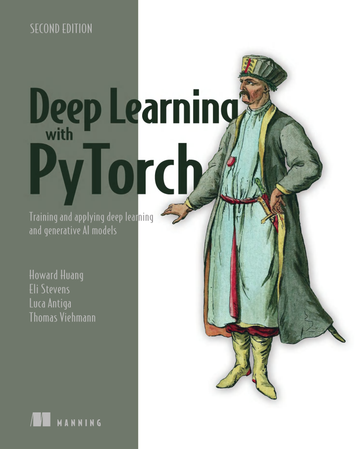

I am revisiting pytorch and reading this book titled

**"Deep Learning With Pytorch By Howard Huang"**

Progress:

Part 1:- 1:✅ 2:✅ 3:✅ 4:🔴 5:❌ 6:❌ 7:❌ 8:❌

Part 2:- 9:❌ 10:❌ 11:❌ 12:❌ 13:❌ 14:❌ 15:❌ 16:❌ 17:❌

